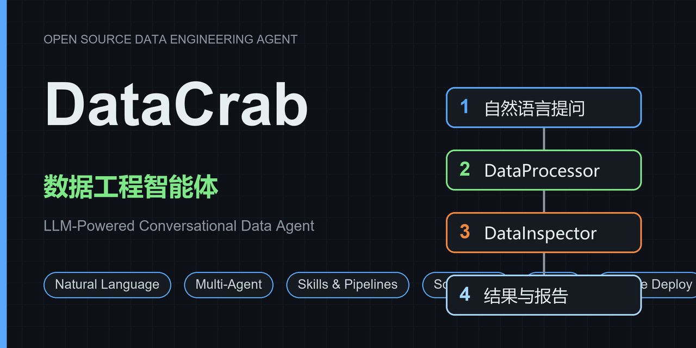
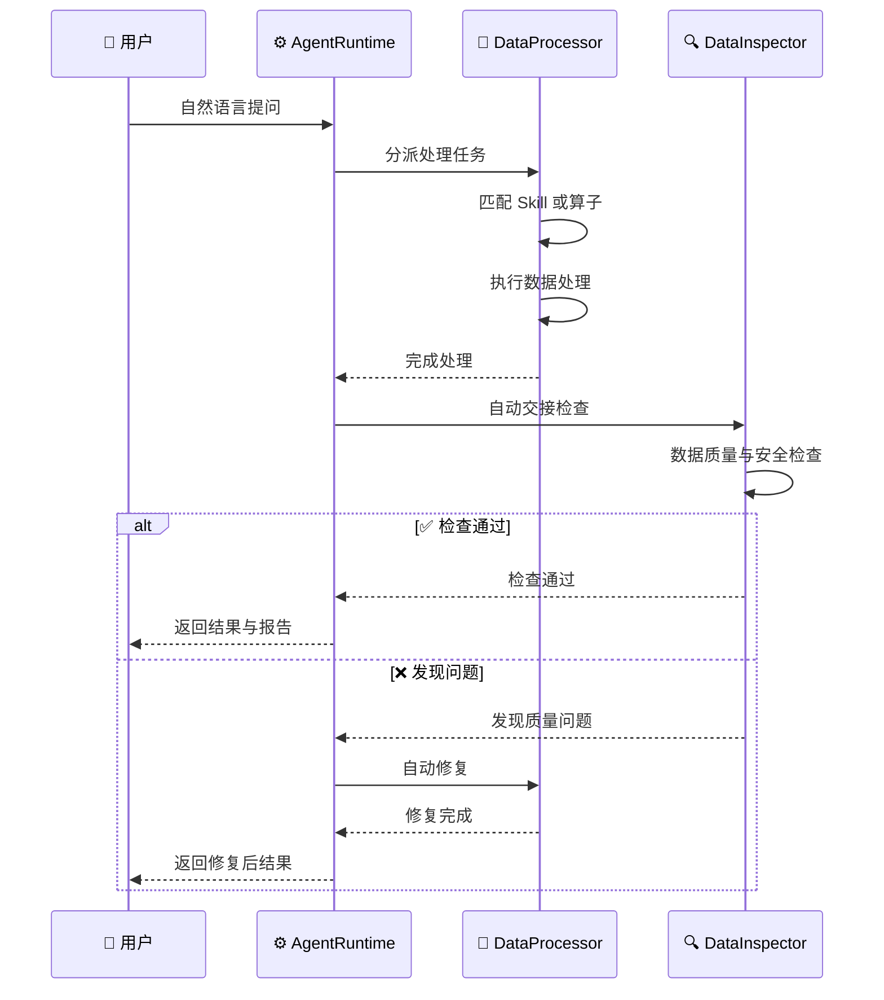

# DataCrab - 数据工程智能体

<p align="center">
  
</p>

<p align="center">
  
  
  
  
  
  
  
</p>

DataCrab 是一款基于大语言模型（LLM）的数据工程智能体，提供 ChatGPT 风格的对话式数据交互体验。用户无需编写代码，通过自然语言对话即可完成数据的查询、清洗、转换、分析和可视化等操作。

- **自然语言处理**：不用写 SQL 和代码，对话即可完成数据处理
- **处理 + 检查闭环**：DataProcessor 处理后自动交接 DataInspector 检查，发现问题自动修复
- **可私有化部署**：支持本地部署、多模型接入和 Docker 一键启动

## 核心流程

_时序图展示 DataCrab 的核心工作方式：用户自然语言提问，DataProcessor 执行处理，AgentRuntime 自动交接 DataInspector 检查，通过后返回结果与报告_



## 核心理念

**通过对话处理数据，沉淀数据处理 Skill，形成数据生态，最终实现 AI 处理数据完全 Loop 化。**

这四个阶段构成 DataCrab 的演进路线——从「人用对话驱动数据」走向「AI 自主完成数据闭环」：

| 阶段 | 理念 | 对应业界趋势 |
|------|------|------------|
| **对话即处理** | 用自然语言代替编码，LLM 理解意图、匹配 Skill、生成可执行代码，结果以表格/图表返回 | Conversational Data Processing、Agentic UI |
| **沉淀即资产** | 每次处理过程自动沉淀为可复用 Skill，逐步构建技能库，越用越聪明 | Skill-based Agent、Compound AI System |
| **生态即闭环** | Skill 积累形成数据生态，DataProcessor 加工 + DataInspector 检查双智能体协作，从接入到输出闭环 | Multi-Agent Collaboration、Human-in-the-loop |
| **Loop 化** | 最终目标：AI 理解需求 → 匹配 Skill → 执行 → 检查 → 自我修复，全程无人干预 | Self-healing Pipeline、Full-loop Automation、Deep Agents |

> **Loop 化**是 DataCrab 的终极目标。正如业界所倡导的 Loop Engineering——不让 AI 只做单步推理，而是让它在「执行 → 观测 → 修正」的循环中持续迭代，直到任务完成。DataCrab 的多智能体 Handoff 机制和技能自我进化能力正是这一理念的具体实践。

---

## 主要功能

### 1. 对话式数据交互

- ChatGPT 风格的聊天界面，支持流式响应（SSE）
- 会话管理：创建、列表、重命名、删除、搜索
- 多轮对话：保留最近 20 条消息作为上下文
- 数据源上下文注入：用户提及数据源时，系统自动查询真实数据并注入到 LLM 提示词中
- 支持停止生成

### 2. 多智能体协作框架

DataCrab 采用 **Orchestrator-Worker** 模式的多智能体协作架构（参考 Claude Code / OpenAI Agents SDK），所有入口统一经由 AgentRuntime：

| 智能体 | 职责 | 触发场景 |
|--------|------|----------|
| **DataProcessor**（Orchestrator） | 理解用户意图、修改/执行脚本、调度数据处理、交接检查 | 聊天页面 + 技能/算子/流程调试助手 |
| **DataInspector**（Worker） | 对加工后的数据进行标准检查、质量检查、安全检查 | DataProcessor 执行成功后 RunTime 自动 handoff |

- **统一架构**：聊天页面和所有调试页面（技能/算子/流程）都走 DataProcessor → DataInspector 多智能体流程
- **Handoff 由 RunTime 决策**：Agent 不感知 handoff 存在，RunTime 拦截 `done` 事件调用 `_decide_handoff()` 决定是否交接（调试模式自动，主对话靠人判断）
- **Orchestrator-Worker 粒度**：简单操作（edit_script / run_script）是 DataProcessor 的工具，复杂推理（质量检查）delegate 给 DataInspector Agent
- **流式工具调用**：`chat_stream_with_tools_and_thinking()` 同时输出推理过程 + 工具调用
- 智能体交接（Handoff）：处理完成自动交接检查，发现问题自动交接修复
- 动态轮次预算：按任务复杂度分配迭代上限（simple=15/medium=25/complex=40）
- 收敛检测：`ConvergenceGuard` 非侵入式组件，动态阈值（= 检查上限×2+3，默认 17）在同一张表来回 handoff → 终止
- 支持并行工具调用
- SSE 流式输出推理过程和执行结果

### 3. 数据源管理

- 插件化连接器架构，支持 8 种数据源：

| 连接器 | 说明 |
|--------|------|
| PostgreSQL | 基于 asyncpg 的异步连接 |
| MySQL | 基于 aiomysql 的异步连接 |
| SQLite | 基于 aiosqlite 的异步连接 |
| CSV | 本地 CSV 文件 |
| Excel | 多 Sheet 支持（最长前缀匹配解析表名） |
| OBS/S3 | 华为云 OBS 对象存储 |
| HDFS | Hadoop HDFS（WebHDFS REST API） |
| ChromaDB | 向量数据库 |

- 连接测试、Schema 发现、表数据分页浏览
- 数据写入支持 7 种策略：`fail`（报错）、`append`（追加）、`replace`（删表重建）、`overwrite`/`truncate`（清空+补列）、`delete_rows`（清空不补列）、`upsert`（按 id 更新或插入）；支持表备注和列备注（PostgreSQL/MySQL/SQLite）
- 数据质量分析（完整性、缺失值、异常值检测）
- 表统计信息（行数、列数、大小）

### 4. 元数据管理

- **技术元数据**：数据源配置时一键自动同步（表结构、行数、字段统计、样本数据）
- **业务元数据**：通过 LLM 分析样本数据自动补充（业务名称、描述、标签、数据域、安全等级）
- 支持人工编辑业务元数据
- 元数据搜索和统计概览

### 5. 算子管理

算子是存储在数据库中的 Python 脚本，支持：

- **上传**：上传 `.py` 文件，AST 解析器自动提取函数名、参数和文档
- **AI 生成**：自然语言描述 → LLM 生成 Python 脚本 → 自动解析创建
- **AI 修改**：自然语言指令修改已有算子脚本，修改后自动验证
- **克隆**：复制算子及其脚本
- **调试/执行**：在沙盒命名空间中运行算子，注入工具函数（query_table_data、llm_chat 等）
- **AI 调试助手**：Chat 风格交互式调试，4 工具模型（edit_script/run_script/read_script/grep_script，对齐 OpenCode Grep/Read/Edit/Bash）；AI 修改脚本后自动执行验证，执行结果直接显示在消息流中；执行成功后 RunTime 自动交接 DataInspector 质量检查；Inspector 报告通过独立事件格式化展示
- **下载**：导出为 `.py` 文件
- **自我进化经验库**：调试失败自动记录反例、修错后成功采集正例，LLM 归纳经验（常见错误+成功模式）并注入后续生成/修改/调试提示词，越用越聪明

### 6. 技能管理

技能遵循 Agent Skills 开放标准，每个技能是一个结构化文件夹：

```
SKILL.md          # YAML 前置信息 + Markdown 说明文档
scripts/          # 可执行的 Python 脚本
references/       # 参考资料
assets/           # 静态资源
```

- **完整生命周期**：创建、读取、更新、删除
- **上传/下载**：`.zip` 包上传自动解压解析，导出为 `.zip`
- **AI 生成**：自然语言描述 → LLM 生成完整技能包
- **AI 修改**：自然语言指令修改 SKILL.md 内容（SSE 流式，展示思考过程）
- **执行**：在子进程沙盒中执行脚本，支持超时控制、SSE 流式状态推送
- **自然语言执行**：LLM 推断执行参数（含推理过程展示），然后运行技能
- **AI 调试助手**：Chat 风格交互式调试，AI 修改脚本后自动执行验证，执行结果显示在消息流中；支持在调试对话框中一键"转为流程"（流式推送 AI 推理过程）
- **技能自我进化**：失败记录反例、修错后成功采集正例，LLM 归纳经验写入 SKILL.md；与算子共用统一经验库，生成新技能时自动注入历史经验
- **技能 JSON 参数样例**：参数定义支持 example 字段，前端自动填入示例值

### 7. 流程（Pipeline）

流程是 DataCrab 的核心编排概念——**每个流程就是一个 Python 主函数**：

- 一个流程 = 一个 Python 主函数 + 它调用的 Skill 脚本
- 从 Skill 一键转换为可独立运行的 Python 主函数（在技能调试页面 AI 助手中触发，流式展示推理过程）
- 代码可视化：展示主函数源码 + 调用关系图
- 调试面板：显示真实函数签名和参数说明，自动生成参数示例（含中文描述）
- 直接执行：无需 DAG 引擎，直接运行主函数
- SSE 流式生成和执行

### 8. 调度系统

- 支持算子、技能和流程的定时执行
- **调度类型**：Cron 表达式、固定间隔（秒）、手动触发
- Cron 表达式校验及下次执行时间预览
- 暂停/恢复调度
- **后台实际执行**：手动触发或定时扫描后，`task_runner.py` 按 task_type 分派到 skill/operator/pipeline 执行器，更新执行记录与调度状态
- **定时调度扫描器**：30 秒间隔自动扫描到期调度，并发控制（`concurrent_runs`）+ `next_run_at` 重算防重复触发，应用 lifespan 启停
- 任务执行追踪：状态、耗时、日志、重试次数

### 9. 大模型公开 API

平台将底层大模型能力以 RESTful API 形式开放：

| 端点 | 说明 |
|------|------|
| `POST /llm/embeddings` | 生成文本嵌入向量 |

- 算子和技能脚本中可直接调用 `llm_chat()` 函数

### 10. 文件链接管理

- 挂载本地文件/目录路径
- 访问控制（公开/私有，允许的文件扩展名）
- Agent 可写入文件到已链接目录

### 11. 认证与权限管理

- JWT 认证（Access Token + Refresh Token）
- RBAC 角色权限控制：用户 → 角色 → 权限
- 权限级别：view、use、manage
- 资源级权限控制（算子、技能、数据源、调度、流程等）
- 权限管理 API：角色 CRUD、权限分配与检查

### 12. LLM 多模型支持

| 提供商 | 说明 |
|--------|------|
| 智谱AI (GLM) | 智谱 AI（默认），GLM-5.2 / GLM-5.1 / GLM-4 / GLM-4-Flash 等 |
| 阿里百炼 | Qwen3.7-Max / Qwen3.6-Flash 等 |
| 硅基流动 | DeepSeek-V3 / Qwen2.5-7B-Instruct 等 |
| Azure OpenAI | 客户端支持（配置 azure_endpoint + api_version） |
| 自定义服务 | 兼容 OpenAI API 的任意端点（vLLM、Ollama 等），可上传适配器代码 |

- 运行时动态切换模型提供商/密钥/模型
- 选择提供商后自动填入官方 API 地址，模型列表自动过滤为该提供商的模型
- **双模型架构**：`_default`（配置的深度模型，用于生成/修改脚本）+ `_flash`（名称含 flash 的快速模型，用于参数推断/对话）；所有 chat 方法用 `self._default`
- 流式输出支持思维链/推理内容
- 工具调用（Function Calling）支持
- 视觉/嵌入模型按 provider 自动选择（GLM→glm-4v-plus/embedding-3 等）；备用模型降级链 + CircuitBreaker 熔断

### 13. 数据标准 / 质量 / 安全规则库

三份 Markdown 规则库，可在「系统设置」页查看编辑，DataInspector 检查时引用对应编号：

| 规则库 | 内容 | 编号 |
|--------|------|------|
| 数据标准库 | 字段级格式与约束（身份证/手机号/邮箱/金额/日期/枚举/行业特化等） | `STD-xxx` |
| 数据质量库 | DAMA 六维度 + ETL 过程质量（完整性/唯一性/对数/数据量波动等） | `DQ-xxx` |
| 数据安全规则库 | PII 识别/凭证泄露/敏感业务数据/数据分级/脱敏/合规 | `SEC-xxx` |

- MD 可编辑、可恢复默认；后端 `GET/PUT/POST /config/data-standards|data-quality|data-security`(+`/reset`)
- DataInspector 提示词注入三份库；检查工具确定性执行正则/聚合，问题标注 `STD/DQ/SEC` 编号；语义类由 LLM 判断
- 检查报告通过 `inspection_report` 独立事件格式化展示（Markdown 表格：列概览 + 问题列表）

### 14. 视频处理能力

- **元数据提取**：`extract_video_info()` 返回时长/分辨率/帧率/编码/码率/总帧数等
- **关键帧抽取**：`extract_keyframes()` 返回带时间戳的关键帧图片列表，帧图片可直接传给 `llm_vision` 做内容理解
- ffmpeg 场景检测优先，未安装时回退 opencv 等间隔抽取；帧图片 PIL 压缩 1024px + JPEG quality 85

### 15. 版本号动态生成

- 版本号格式：`YYYY.MM.DD.提交次数`（git log 生成，`@lru_cache` 缓存）
- 侧边栏底部、登录页、关于页三处显示
- `GET /config/version` 端点（无需认证）

### 16. 关于页

- 系统设置中新增「关于」tab，展示项目简介、核心特性、技术栈、开源地址

---

## 技术栈

### 后端

- **语言**：Python 3.11+
- **Web 框架**：FastAPI + Uvicorn
- **ORM**：SQLAlchemy 2.0（异步，支持 SQLite / PostgreSQL）
- **LLM 集成**：智谱 GLM / 阿里百炼 / 硅基流动 / Azure / 自定义 OpenAI 兼容
- **数据处理**：pandas, numpy

### 前端

- **框架**：Vue 3 + TypeScript + Composition API
- **构建工具**：Vite 5
- **UI 组件库**：Element Plus
- **状态管理**：Pinia
- **路由**：Vue Router 4
- **图表**：ECharts 5
- **代码编辑器**：Monaco Editor
- **Markdown 渲染**：markdown-it + highlight.js
- **流程编辑**：Vue Flow

### 数据存储

- **数据库**：SQLite（开发）/ PostgreSQL 14+（生产）
- **文件存储**：本地文件系统

---

## 项目结构

```
DataCrab/
├── backend/                    # 后端服务
│   ├── app/
│   │   ├── main.py            # FastAPI 入口
│   │   ├── core/              # 核心配置（数据库、安全、类型）
│   │   ├── api/v1/endpoints/  # API 端点（16 个端点文件，183 条路由）
│   │   ├── models/            # ORM 模型（19 个模型类，10 个文件）
│   │   ├── schemas/           # Pydantic 请求/响应模式
│   │   └── services/          # 业务逻辑服务
│   │       ├── llm.py         # LLM 管理器（多提供商、流式、工具调用）
│   │       ├── agent.py       # Agent 服务（工具调用循环）
│   │       ├── multi_agent.py # 多智能体运行时（Handoff、AgentRegistry）
│   │       ├── data_processor_agent.py  # DataProcessor 智能体
│   │       ├── data_inspector_agent.py  # DataInspector 智能体
│   │       ├── inspector_tools.py       # 数据检查工具集
│   │       ├── skill_library.py  # 向量索引 + 语义搜索（磁盘持久化）
│   │       ├── skill_parser.py   # SKILL.md 解析器
│   │       ├── skill_runner.py   # 子进程沙盒执行器
│   │       ├── skill_creator.py  # AI 技能包生成器
│   │       ├── sandbox_ns.py     # 算子沙箱命名空间（从 operator.py 抽出）
│   │       ├── task_runner.py    # 调度任务后台执行器 + 定时扫描器
│   │       ├── pipeline_builder.py  # 流程生成器
│   │       ├── pipeline_executor.py # 流程执行引擎
│   │       ├── connectors.py    # 8 种数据源连接器
│   │       ├── shared_tools.py  # 7 个公共工具统一入口（LRU 缓存）
│   │       ├── agent_utils.py   # Agent 工程工具（反幻觉/轮次预算/压力告警/压缩等）
│   │       ├── tool_guidance.py # 工具诚实能力表（主对话/调试拆分）
│   │       ├── data_harness.py # 非侵入式流程层 Harness（收敛检测+经验采集）
│   │       ├── experience.py   # 自我进化经验库（正反例+归纳）
│   │       ├── operator_parser.py # Python AST 脚本解析器
│   │       └── video_utils.py  # 视频处理（关键帧抽取+元数据提取）
│   └── data/skills/           # 技能包磁盘存储
├── frontend/                   # 前端应用
│   ├── src/
│   │   ├── views/             # 16 个页面组件（11 条路由）
│   │   ├── router/            # 路由配置
│   │   ├── stores/            # Pinia 状态管理
│   │   ├── api/               # Axios API 客户端
│   │   └── composables/       # Vue 组合函数
│   └── package.json
├── package.json               # npm 统一安装/启动脚本
├── INSTALL.md                 # 安装与运行指南
└── design.md                  # 技术架构设计文档
```

---

## 快速开始

详见 [INSTALL.md](INSTALL.md)。

### 环境要求

- Python 3.11+
- Node.js 16+

### 一键启动

```bash
# 安装依赖
npm install

# 开发模式（前后端并行启动）
npm run dev
```

### 单独启动

```bash
# 后端
cd backend
pip install -e .
python -m uvicorn app.main:app --reload --host 0.0.0.0 --port 8000

# 前端
cd frontend
npm install
npm run dev    # Vite 开发服务器，默认端口 5173
```

---

## API 概览

所有 API 路由前缀为 `/api/v1/`：

| 路径 | 功能 |
|------|------|
| `/auth` | 登录、注册、令牌刷新 |
| `/chat` | 会话管理、消息、流式对话、自然语言数据处理 |
| `/datasources` | 数据源 CRUD、连接测试、表数据/统计/质量 |
| `/skills` | 技能全生命周期、上传/下载、运行、AI 生成/修改 |
| `/operators` | 算子 CRUD、上传、生成、修改、调试、克隆 |
| `/pipelines` | 流程 CRUD、从 Skill 生成、执行、克隆 |
| `/schedules` | 调度 CRUD、暂停/恢复、触发、统计 |
| `/metadata` | 元数据管理、AI 补充业务元数据 |
| `/filelinks` | 文件链接 CRUD |
| `/llm` | 文本嵌入向量 |
| `/config` | LLM 配置、Agent 人格、数据标准/质量/安全规则库、可用模型列表 |
| `/agents` | 智能体列表、运行智能体、数据检查、事件/血缘 |
| `/knowledge` | 文档知识库 RAG（上传/切片/嵌入/语义检索） |
| `/permissions` | 权限管理（RBAC：用户/角色/权限） |
| `/filesystem` | 文件系统浏览 |
| `/connectors`, `/providers` | 自定义数据源连接器 + LLM Provider 适配器管理 |

---

## 架构亮点

1. **多智能体协作闭环**：DataProcessor + DataInspector 双智能体，Handoff 由 RunTime 自动决策（Agent 不感知 handoff），处理+检查形成自愈闭环（Multi-Agent Collaboration）
2. **插件化连接器**：`BaseConnector` 抽象类 + 注册表模式，轻松扩展新数据源类型
3. **技能包标准**：结构化文件夹格式（SKILL.md + scripts），兼顾人类可读与机器可解析，Skill 即资产可沉淀可复用
4. **流程 = Python 主函数**：抛弃 DAG 模型，每个流程就是一个可独立运行的 Python 函数
5. **自我进化经验库**：算子与技能统一 `experience.json` 经验库——失败记录反例、修错后成功采集正例，LLM 归纳为「常见错误+成功模式」并注入生成/修改/调试提示词，形成"执行→记录→归纳→注入"闭环，越用越聪明
6. **LLM 能力注入**：算子和技能脚本中可直接调用 `llm_chat()` 函数，无需走 HTTP 请求
7. **元数据管理**：技术元数据一键同步 + 业务元数据 AI 补充，统一数据目录
8. **流式优先架构**：多处端点支持 SSE 流式响应，提供实时反馈
9. **AST 脚本自省**：Python AST 解析自动提取函数签名和文档，零配置注册算子
10. **AI 调试助手**：Chat 风格交互式调试（4 工具对齐 OpenCode），AI 推理过程可视化，执行失败自动反馈错误堆栈给 AI 修复（Loop Engineering 实践）
11. **Prefix Cache 优化**：system prompt 进程级 memoize + datasource_context 移出 system → user message，字节稳定命中 GLM context cache，input 成本降 30%+
12. **Docker 一键部署**：前端多阶段构建 nginx 托管 + SSE 长连接支持 + 数据卷持久化

---

## 📈 更新信息

### 2026-08-10

| 类别 | 更新内容 |
| --- | --- |
| 安全加固 | P0 公网安全加固 8 项全部到位，包括默认密钥与口令替换、关闭公开注册、内部接口鉴权、基础设施端口不暴露、HTTPS 与安全头、接口限流、备份脚本、服务器加固脚本 |
| 新智能体 | 新增 DataAnalyst 数据分析智能体，提供只读查询、统计与洞察独立路由，并支持流式输出与前端调试 |
| 上游同步 | 完成第三次上游同步（13 个提交），覆盖 DataAnalystAgent、技能端点修复、Inspector 报告、SystemPrompt 精简等 |
| Agent 迭代 | 调试工具精简为 4 个，Inspector 报告独立事件展示，前端复制按钮与版本号动态生成上线 |
| 部署完善 | 前端多阶段构建、nginx 托管、SSE 长连接支持与数据卷持久化完善 |

> 💡 **提示：** 完整迭代记录见 [AGENTS.md](AGENTS.md)，最新提交见 [f08a74d](https://github.com/jamsin77/DataCrab/commit/f08a74d5f85554e9d86bcd9e2933e9f1d605fd54)。
